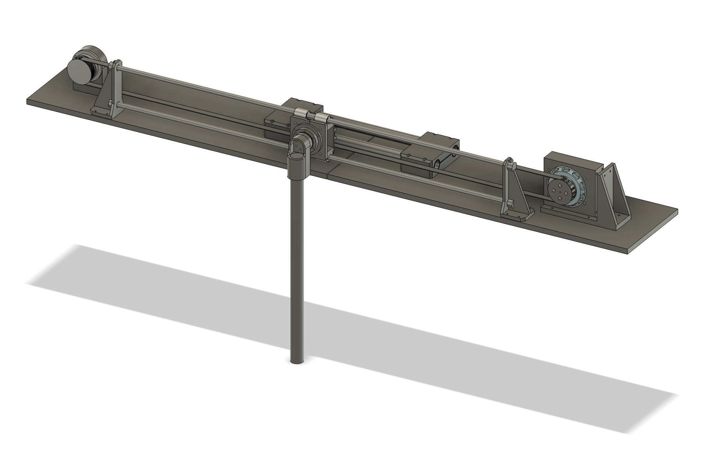

# ODriveCartPole


ODrive cart pole repo for inverted pendulum lab. View associated slides/Colab links here: https://tinyurl.com/yrhwf7e7

## Robot Build Documentation


There is no complete documenation available for the robot build, but .STEP files for the 3D printed parts are in the `build_files` directory. Fasteners are metric. Some heatset inserts are used. Major parts are from ODrive:

- Motor with encoder magnet (https://shop.odriverobotics.com/products/m8325s?_pos=8&_sid=f0f0d35bd&_ss=r)
- Motor controller - screw terminals (https://shop.odriverobotics.com/products/odrive-s1?variant=40926827872326)
- Motor controller mount (https://shop.odriverobotics.com/collections/cases-and-enclosures/products/heat-spreader-plate-for-odrive-s1)
- Magnetic encoder (https://shop.odriverobotics.com/products/odrive-rs485-magnetic-encoder)
- Encoder cable - 2m (https://shop.odriverobotics.com/products/cable-for-16384-cpr-absolute-rs485-encoder-for-odrive-s1?variant=40926828953670)
- USB cord and isolator (https://shop.odriverobotics.com/products/usb-c-to-usb-a-cable-and-usb-isolator)

## Tune a Linear PID Controller
[](
https://colab.research.google.com/github/jamesmwang/ODriveCartPole/blob/main/notebooks/tune_pid.ipynb
)

The link above can be used to access a Google Colaboratory notebook where you can tune PID gains on an accurate nonlinear dynamics model of the cartpole robot.

## Train a Reinforcement Learning Policy
[](
https://colab.research.google.com/github/jamesmwang/ODriveCartPole/blob/main/notebooks/train_rl_policy.ipynb
)

The link above can be used to access a Google Colaboratory notebook where you can train an RL policy to complete swing-up of an accurate nonlinear dynamics model of the cartpole robot.

## Robot Control Mac Installation
### Create Virtual Environment
```bash
python3 -m venv myenv
source myenv/bin/activate
```

### Install and Run odrivetool
See instructions: https://docs.odriverobotics.com/v/latest/interfaces/odrivetool.html#install-odrivetool
```bash
brew install python3
pip install --upgrade pip
pip3 install --upgrade odrive
odrivetool
```
### Install Other Dependencies
```bash
pip install -r requirements.txt
```

## Robot Control Linux Installation
Nate's installation experience on Ubuntu 22.04:

**Prerequisites:** this tutorial assumes that you have installed the [mamba](https://github.com/mamba-org/mamba) package manager. If you have conda instead, you can replace mamba with conda in the commands below.

```
mamba create -n cartpole
mamba activate cartpole
pip3 install matplotlib
pip3 install --upgrade odrive
mamba install pytorch torchvision torchaudio -c pytorch
pip3 install torchsummary
```

Set up the udev tools: (from [odrive](https://docs.odriverobotics.com/v/latest/interfaces/odrivetool.html))
```
sudo bash -c "curl https://cdn.odriverobotics.com/files/odrive-udev-rules.rules > /etc/udev/rules.d/91-odrive.rules && udevadm control --reload-rules && udevadm trigger"
```

To run the cart-pole:
```
mamba activate cartpole
cd ODriveCartPole
python3 odrive_ctrl_v7.py
```